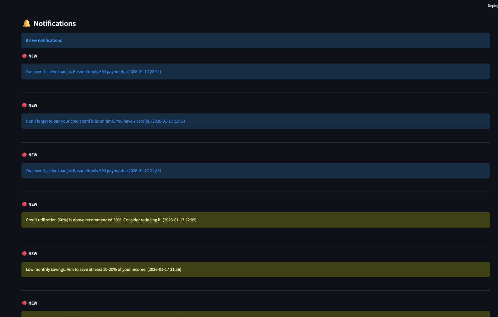

# 🏴‍☠️ [Project Code] Captain Credo: The Financial Navigator

## 📌 Purpose of the Application
**The Problem:** Millions of first-time borrowers face "Credit Invisible" status or fall into debt traps because they cannot visualize the long-term impact of their daily financial decisions. Existing tools are reactive—they tell you what happened *after* your score drops.

**The Solution:** **Captain Credo** provides a **proactive**, **cognitive** approach to finance. It predicts consequences, helping users understand the *why* behind their credit score and how to steer toward financial stability.

---

## ⚙️ How It Works?
1. **Onboarding:** Users enter basic financial details (Income, Expenses, Loans) into their **User Profile**.
2. **Data Processing:** Backend uses **Pandas** and **NumPy** to clean data and calculate metrics like Debt-to-Income (DTI) and Credit Utilization.
3. **Predictive Analysis:** **Random Forest Regressor** predicts credit trends and loan eligibility probabilities.
4. **Simulation:** Users interact with the **What-If Simulator** to test financial scenarios.
5. **Reality Check:** Retrospective timeline maps past financial mistakes to current credit health.
6. **Continuous Monitoring:** Real-time **Navigational Alerts** notify users about high utilization or upcoming EMI deadlines.

---

## 🌊 How It Helps (Impact)
- **Social Impact:** Empowers underserved communities with financial literacy in an engaging gamified way.  
- **Institutional Impact:** Reduces default rates for banks by creating informed borrowers.  
- **Business Impact:** Scalable fintech integration with predictive “Shadow Score” for users without traditional credit history.  
- **Why Judges Should Care:** Bridges the gap between reactive tracking and intelligent prediction, solving financial unawareness.

---

## ⚔️ Features
- 📊 **Financial Command Center:** Unified dashboard for budgets, spending logs, and credit trends.  
- 🔮 **What-If Simulator:** Predict your credit score before making financial decisions.  
- ⏳ **Reality Check Timeline:** Visualize past mistakes and consequences.  
- 📉 **Credit Health Analysis:** AI-powered loan eligibility & risk assessment.  
- 🧮 **Smart EMI Tools:** EMI calculators and affordability insights.  
- 🔔 **Navigational Alerts:** Proactive notifications for credit utilization and bill deadlines.  

---

## 🖼️ Screenshots

### 🔹 Financial Dashboard


### 🔹 User Profile


### 🔹 Credit Score History


### 🔹 Credit Health Analysis


### 🔹 EMI Calculator & Tools


### 🔹 Loan Comparison


### 🔹 Notifications & Alerts


### 🔹 What-If Simulator


---

## 🌍 Deployed URL
🔗 [https://hm069-byte-us.onrender.com]

---

## 🎥 Demo Video
📽️ [https://drive.google.com/file/d/17V8uE11DfvHI8u5DIYlOWIHgoyfVekJz/view?usp=drive_link]

---

## 🛠 Tech Stack & APIs Used

### Frontend
- **Streamlit**: Interactive web framework for Python  
- **Streamlit Option Menu**: Navigation component  
- **Custom CSS**: Dark theme, pirate aesthetic  

### Backend
- **Python 3.11+**  
- **Pandas**: Data manipulation  
- **NumPy**: Numerical computations  

### Machine Learning
- **Scikit-learn**: RandomForestClassifier & RandomForestRegressor  
- **Pickle**: Model serialization  

### Data Storage
- **JSON Files**: User profiles, credit history, alerts, loan options  

### PDF Generation
- **ReportLab**: Professional PDF report generation  

---

## 📊 System / Use Case Diagram

---

## 🔭 Upcoming / Future Features
- 🏦 **Open Banking API Integration**: Automate expense tracking via bank statements  
- 🦜 **AI Voice Navigator**: Multilingual voice assistant explaining financial terms  
- 🪙 **Treasure Rewards**: Gamified incentives for savings & high credit score  
- 🛡️ **Fraud Detection**: Predictive alerts for unusual spending  

---

## ⚓ How to Fork / Clone the Project
1. **Clone the Repository:**  
```bash
git clone https://github.com/naishasahni/captain-credo.git
cd captain-credo
```
2. **Create Virtual Environment:**  
```bash
python -m venv venv
# Windows
venv\Scripts\activate
# Mac/Linux
source venv/bin/activate
```
3. **Install Dependencies:**  
```bash
pip install -r requirements.txt
```
4. **Launch the App:**  
```bash
streamlit run Dashboard.py
```

---

## 🗂️ Project Structure
```
Hackathon/
│
├── Dashboard.py                 # Main Streamlit app
├── requirements.txt             # Python dependencies
├── logo.png                     # App logo
│
├── utils/                       # Utility modules
│   ├── data_handler.py
│   ├── calculators.py
│   ├── alerts.py
│   └── pdf_generator.py
│
├── models/                      # ML models
│   ├── credit_health_model.py
│   ├── credit_health_model.pkl
│   ├── eligibility_model.pkl
│   ├── what_if_model.py
│   └── whatif_model.pkl
│
├── data/                        # Data storage
│   ├── user_profile.json
│   ├── credit_history.json
│   ├── alerts.json
│   └── loan_options.json
│
└── reports/                     # Generated PDFs
    └── monthly_report_*.pdf
```

---

## 👨‍💻 Team & Contact
- **[Naisha Sahni]** – [naishasahni@gmail.com] – [naishasahni]  
- **[Aditi Kadlag]** – [aditikad2004@gmail.con] – [aditikad2004]  
- **[Shubham Jadhav]** – [shubhampjadhav002@gmail.com] – [Shoya0002]  
- **[Sarthak Gapate]** – [sarthakgapate3377@gmail.com] – [sarthakgapate3377]  

---

## 📜 License
This project is licensed under the **MIT License**.

---

🚀 Thank You for Exploring **Captain Credo**!  
We hope this project helps first-time borrowers navigate the complex seas of credit and achieve financial stability. ⚓
